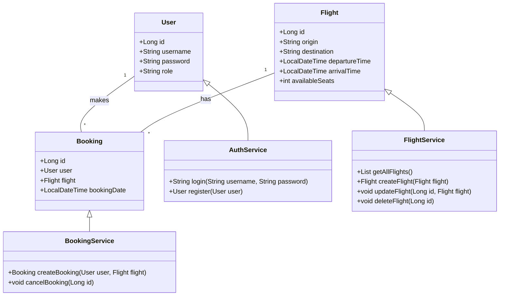

# ✈️ Airline Factoría F5

## 📌 Project Description
This project is a REST API for managing an airline. It allows administration of flights, bookings, users, and authentication via JWT.

## 🛠️ Technologies Used
- **Java 21** ☕
- **Spring Boot 3.4.1** 🌱
- **Spring Security** 🔐
- **Spring Data JPA** 🗄️
- **Hibernate** 🏗️
- **MySQL in Docker** 🐬
- **HikariCP** 🚀
- **JUnit & Mockito for testing** ✅
- **GitHub Actions for CI/CD** 🤖

## 🚀 Installation & Execution
### 📥 1. Clone the Repository
```bash
git clone https://github.com/OlenaMyroshnykova/newairline.git
cd airline
```

### 🐳 2. Run MySQL in Docker
```bash
docker run --name mysql -e MYSQL_ROOT_PASSWORD=your_password -e MYSQL_DATABASE=airline_db -p 3306:3306 -d mysql:8
```

### 🏗️ 3. Build the Project
```bash
mvn clean package
```

### ▶️ 4. Run the Application
```bash
java -jar target/airline.jar
```

## API Endpoints
### Authentication
- `POST /api/auth/register` - Register a new user

### User Management
- `GET /api/user/profile` - Get current user's profile
- `POST /api/user/upload-avatar` - Upload user avatar

### Airport Management
- `GET /api/airports` - Get all airports
- `GET /api/airports/{id}` - Get airport by ID
- `POST /api/admin/airports` - Create an airport
- `PUT /api/admin/airports/{id}` - Update an airport
- `DELETE /api/admin/airports/{id}` - Delete an airport

### Flight Management
- `GET /api/flights` - Get all flights
- `GET /api/flights/{id}` - Get flight by ID
- `GET /api/flights/search?originAirportId={id}&destinationAirportId={id}` - Search flights
- `POST /api/admin/flights` - Create a flight
- `PUT /api/admin/flights/{id}` - Update a flight
- `DELETE /api/admin/flights/{id}` - Delete a flight

### Booking Management
- `GET /api/bookings` - Get all bookings
- `POST /api/bookings` - Create a new booking
- `PUT /api/bookings/{id}/confirm` - Confirm a booking
- `PUT /api/bookings/{id}/cancel` - Cancel a booking


## 🛠️ Class Diagram



