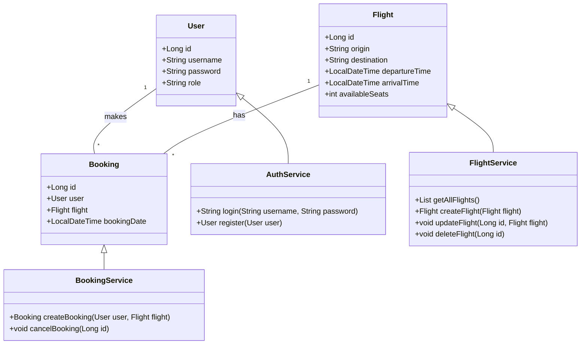

# ✈️ Airline Factoría F5

## 📌 Project Description
This project is a REST API for managing an airline. It allows administration of flights, bookings, users, and authentication via JWT.

## 🛠️ Technologies Used
- **Java 21** ☕
- **Spring Boot 3.4.1** 🌱
- **Spring Security** 🔐
- **Spring Data JPA** 🗄️
- **Hibernate** 🏗️
- **MySQL in Docker** 🐬
- **HikariCP** 🚀
- **JWT for authentication** 🔑
- **JUnit & Mockito for testing** ✅
- **GitHub Actions for CI/CD** 🤖

## 🚀 Installation & Execution
### 📥 1. Clone the Repository
```bash
git clone https://github.com/OlenaMyroshnykova/airline.git
cd airline
```

### 🐳 2. Run MySQL in Docker
```bash
docker run --name mysql -e MYSQL_ROOT_PASSWORD=your_password -e MYSQL_DATABASE=airline_db -p 3306:3306 -d mysql:8
```

### 🏗️ 3. Build the Project
```bash
mvn clean package
```

### ▶️ 4. Run the Application
```bash
java -jar target/airline.jar
```

## 📡 API Endpoints
### 🛂 Authentication
- `POST /auth/login` → Returns a JWT token for authentication.

### 🛫 Flights
- `GET /flights` → List available flights.
- `POST /flights` → Create a new flight (*Admin*).
- `PUT /flights/{id}` → Edit a flight (*Admin*).
- `DELETE /flights/{id}` → Delete a flight (*Admin*).

### 🎫 Bookings
- `POST /bookings` → Create a booking.
- `GET /bookings` → List user bookings.
- `DELETE /bookings/{id}` → Cancel a booking.

## 🛠️ Class Diagram


## 📄 License
This project is licensed under the **MIT License**.

---

This `README.md` provides a clear overview of the project with **installation steps**, **API details**, and **architecture**. Let me know if you want any modifications! 😊


