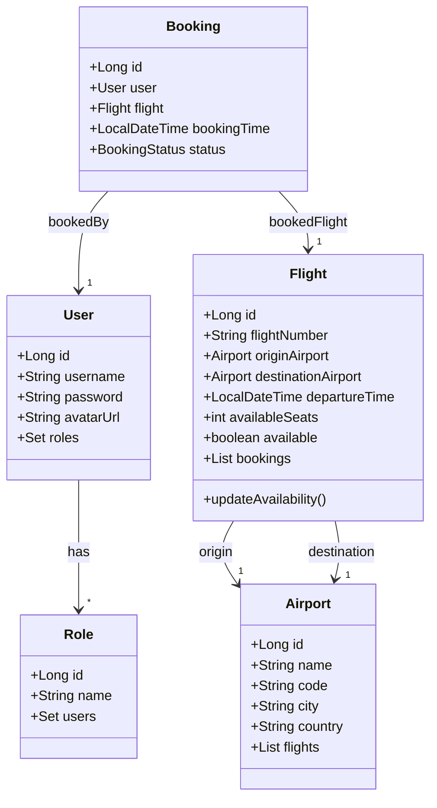

# NewAirline Project

## Overview
NewAirline is a Spring Boot-based airline management system that provides functionality for managing flights, bookings, users, and authentication. The system follows SOLID principles, uses Java 21, and integrates with MySQL in Docker.

## Technologies Used
- Java 21
- Spring Boot 3.4
- Spring Security
- MySQL (Docker)
- JPA/Hibernate
- Mockito (Testing)
- JUnit 5
- Testcontainers
- Lombok
- Maven

## Class Diagram


## API Endpoints
### Authentication
- `POST /api/auth/register` - Register a new user

### User Management
- `GET /api/user/profile` - Get current user's profile
- `POST /api/user/upload-avatar` - Upload user avatar

### Airport Management
- `GET /api/airports` - Get all airports
- `GET /api/airports/{id}` - Get airport by ID
- `POST /api/admin/airports` - Create an airport
- `PUT /api/admin/airports/{id}` - Update an airport
- `DELETE /api/admin/airports/{id}` - Delete an airport

### Flight Management
- `GET /api/flights` - Get all flights
- `GET /api/flights/{id}` - Get flight by ID
- `GET /api/flights/search?originAirportId={id}&destinationAirportId={id}` - Search flights
- `POST /api/admin/flights` - Create a flight
- `PUT /api/admin/flights/{id}` - Update a flight
- `DELETE /api/admin/flights/{id}` - Delete a flight

### Booking Management
- `GET /api/bookings` - Get all bookings
- `POST /api/bookings` - Create a new booking
- `PUT /api/bookings/{id}/confirm` - Confirm a booking
- `PUT /api/bookings/{id}/cancel` - Cancel a booking

## Running the Project
### Prerequisites
Ensure you have the following installed:
- Docker
- Java 21
- Maven

### Steps
1. Clone the repository:
   ```sh
   git clone https://github.com/OlenaMyroshnykova/NewAirline.git
   cd NewAirline
   ```
2. Start the MySQL container:
   ```sh
   docker-compose up -d
   ```
3. Build and run the application:
   ```sh
   mvn clean install
   mvn spring-boot:run
   ```
4. Access the API at `http://localhost:8080/api`.

## Running Tests
To execute the test suite, run:
```sh
mvn test
```

## License
This project is open-source and available under the MIT License.

